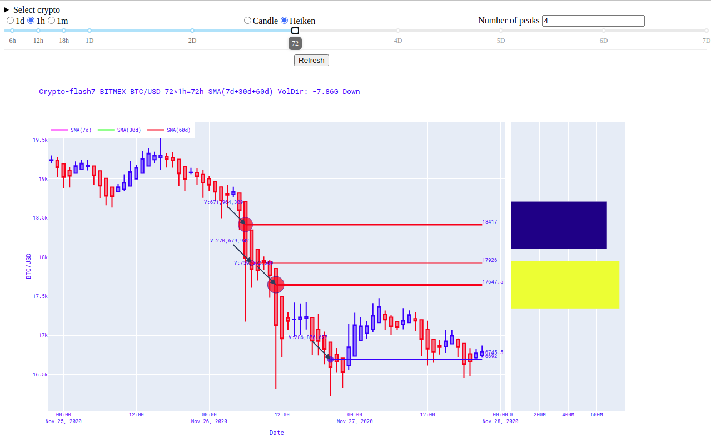
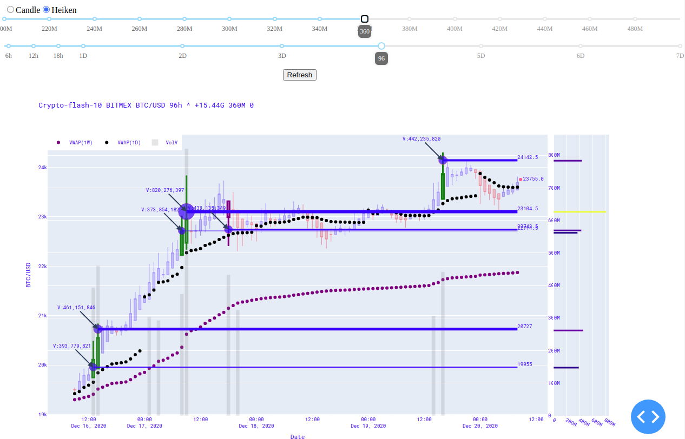
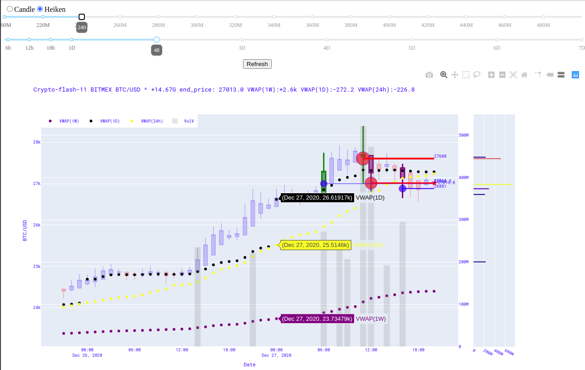
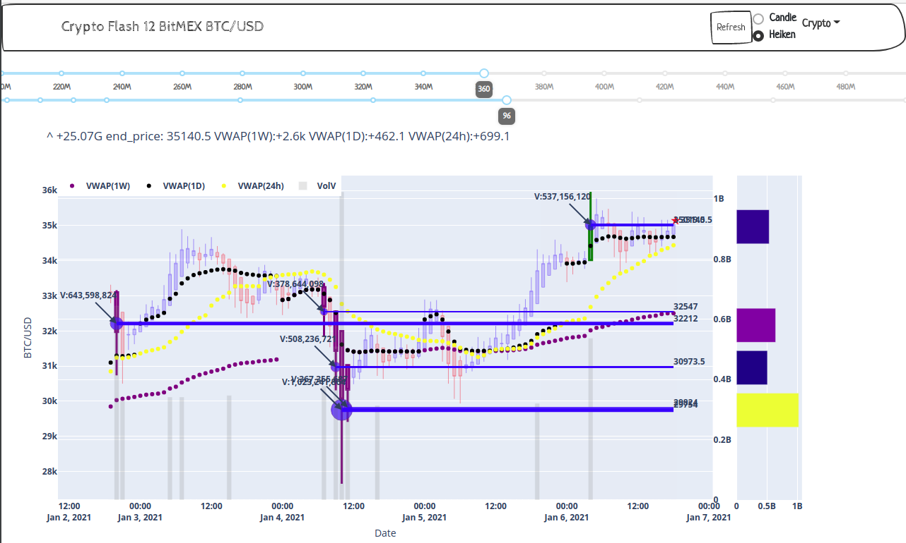

# Crypto-flash
ru-RU.UTF8

Загружаем BTCUSD с биржи Bitmex в mySQL, рисуем графики и в перспективе с помощью Глубокого Машинного обучения по всплескам объемов определяем наиболее вероятное движение цены. 
Пока должно выглядеть как-то так:

