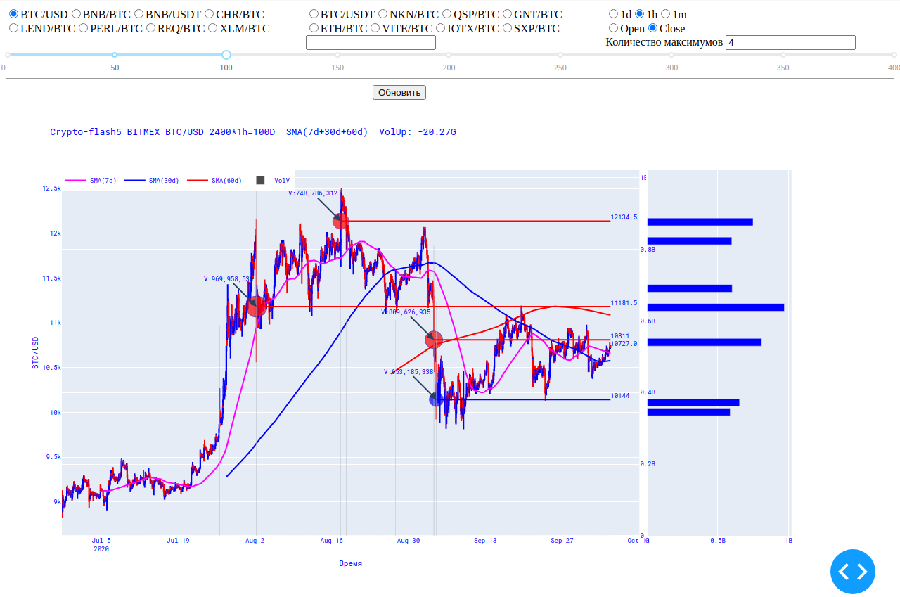
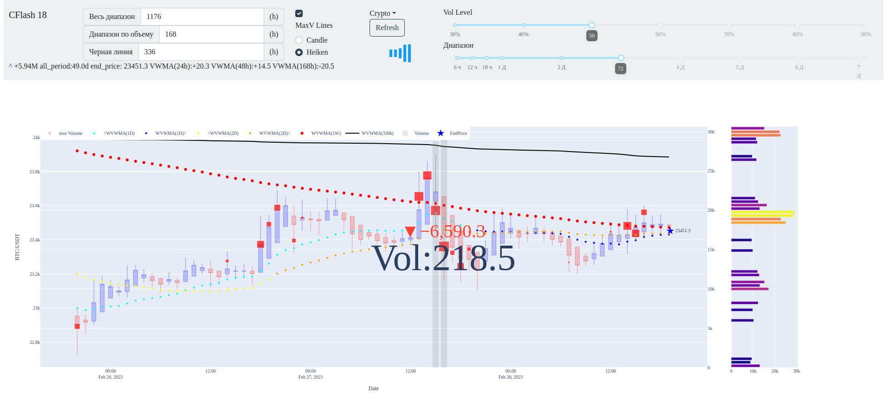
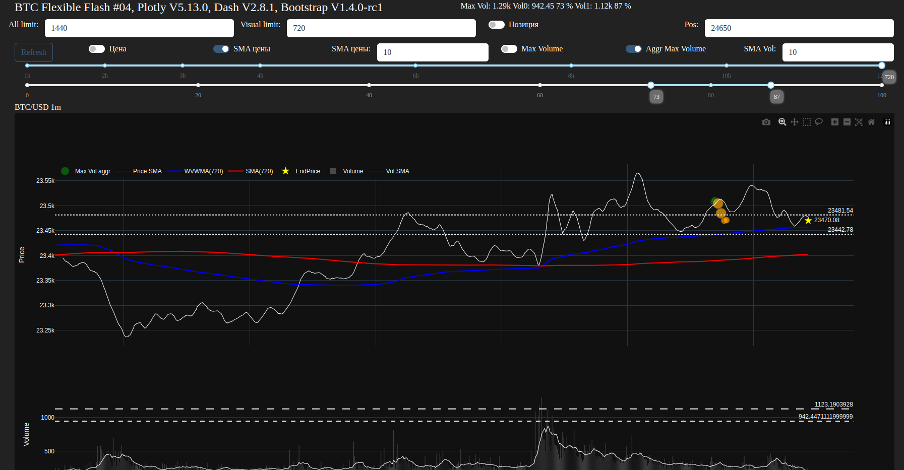

# Crypto-flash
# ru-RU.UTF8

Загружаем BTCUSD с биржи Bitmex в mySQL, рисуем графики и в перспективе с помощью Глубокого Машинного обучения по всплескам объемов определяем наиболее вероятное движение цены. 
Пока должно выглядеть как-то так: 
Версия cf5:   
Версия cf7:   
Версия cf10:   
Версия cf11:   
Версия cf12:   
Версия cf14:   
Версия cf16:   
Версия cf17.1:   
Версия cf18:   

# FlexibleFlash
Версия FF-04:   
