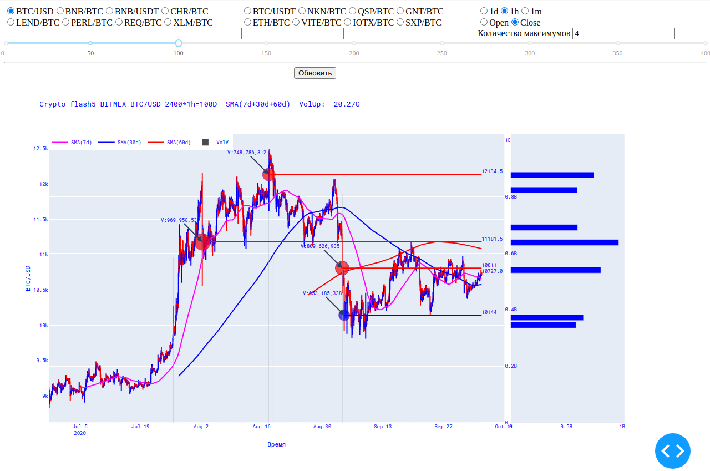
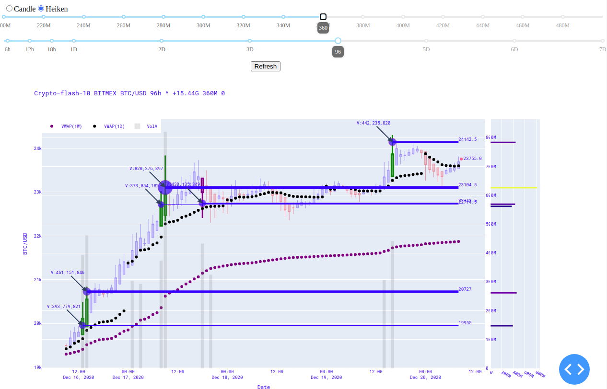
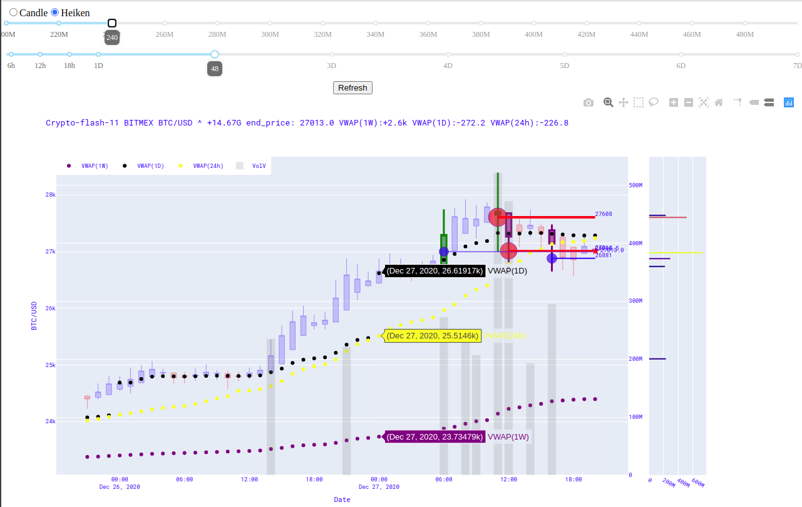
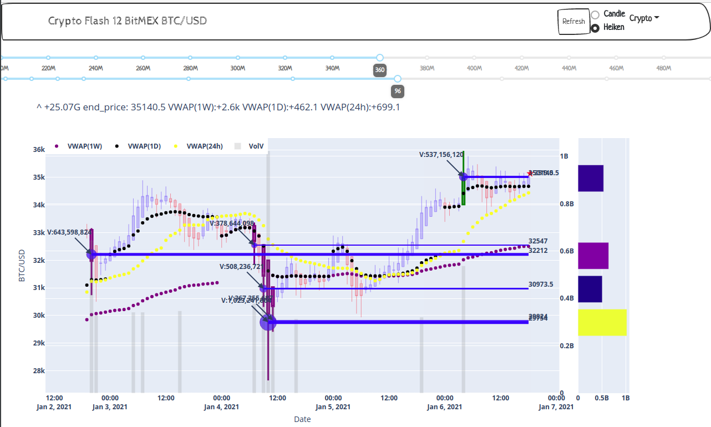
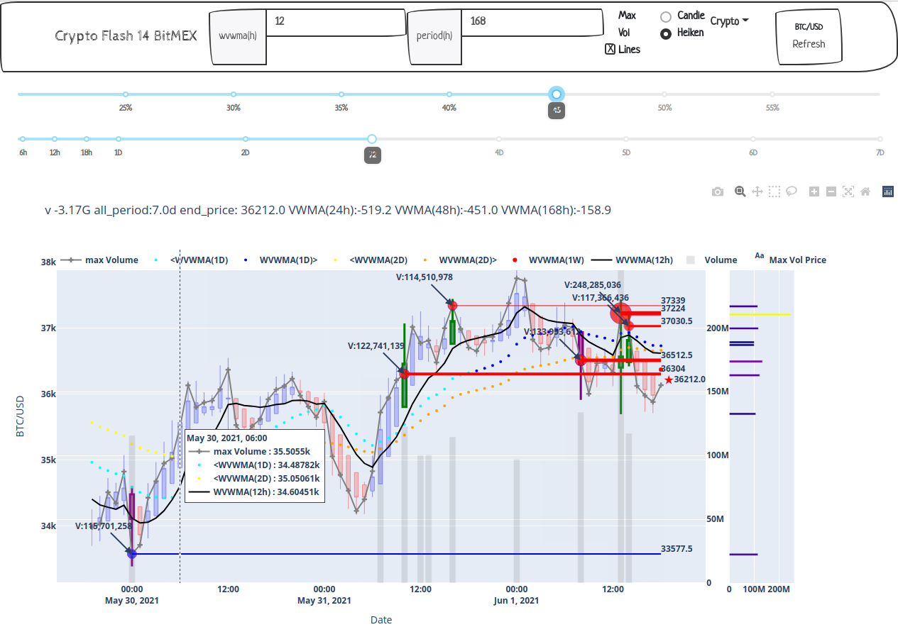
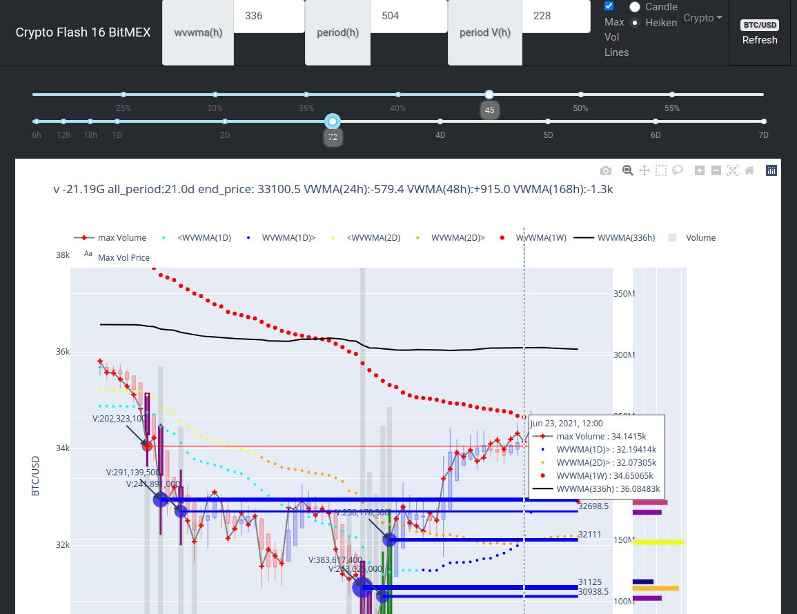
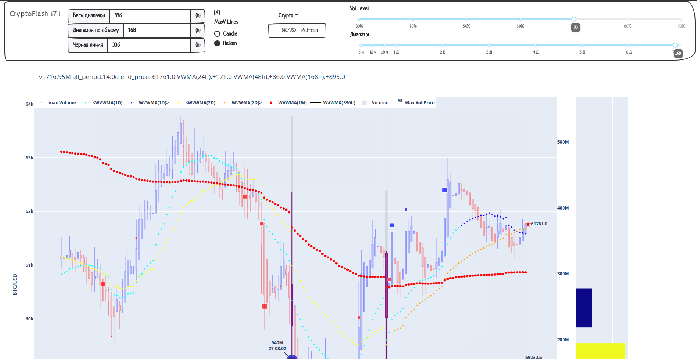

# Crypto-flash
# ru-RU.UTF8

Загружаем BTCUSD с биржи Bitmex в mySQL, рисуем графики и в перспективе с помощью Глубокого Машинного обучения по всплескам объемов определяем наиболее вероятное движение цены. 
Пока должно выглядеть как-то так: 
Версия 4 
Версия 7 
Версия 10 
Версия 11 
Версия 12 
Версия 14 
Версия 16 
Версия 17.1 
